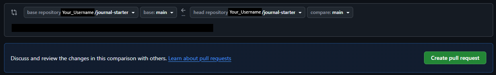

# Topic 5: Capstone - Journal API

Welcome to your Python capstone project! You'll be working with a **FastAPI + PostgreSQL** application that helps people track their daily learning journey. This will prepare you for deploying to the cloud in the next phase.

By the end of this capstone, your API should be working locally and ready for cloud deployment.

## Table of Contents

- [Getting Started](#-getting-started)
- [Development Workflow](#-development-workflow)
- [Development Tasks](#-development-tasks)
- [Data Schema](#-data-schema)
- [AI Analysis Guide](#-ai-analysis-guide)
- [Troubleshooting](#-troubleshooting)
- [Extras](#-extras)
- [License](#-license)

## 🚀 Getting Started

### Prerequisites

- Git installed on your machine
- Docker Desktop installed and running
- VS Code with the Dev Containers extension

### 1. Fork and Clone the Repository

Run these commands on your **host machine** (your local terminal, not inside a container):

1. **Fork this repository** to your GitHub account by clicking the "Fork" button at the top right of this page. This creates your own copy of the project under your GitHub account.

   > ⚠️ **Important:** Always clone **your fork**, not this original repository. All your work and Pull Requests should happen on your fork. Do **not** open PRs against the original `learntocloud/journal-starter` repo.

1. **Clone your fork** to your local machine (replace `YOUR_USERNAME` with your actual GitHub username):

   ```bash
   git clone https://github.com/YOUR_USERNAME/journal-starter.git
   ```

   **Verify your remote** points to your fork (not `learntocloud`):
   ```bash
   git remote -v
   # Should show: origin  https://github.com/YOUR_USERNAME/journal-starter.git
   ```

1. **Navigate into the project folder**:

   ```bash
   cd journal-starter
   ```

1. **Open in VS Code**:

   ```bash
   code .
   ```

### 2. Configure Your Environment (.env)

Environment variables live in a `.env` file (which is **git-ignored** so you don't accidentally commit secrets). This repo ships with a template named `.env-sample`.

Copy the sample file to create your real `.env`. Run this from the **project root on your host machine**:

```bash
cp .env-sample .env
```

### 3. Set Up Your Development Environment

1. **Install the Dev Containers extension** in VS Code (if not already installed)
2. **Reopen in container**: When VS Code detects the `.devcontainer` folder, click "Reopen in Container"
   - Or use Command Palette (`Cmd/Ctrl + Shift + P`): `Dev Containers: Reopen in Container`
3. **Wait for setup**: The API container will automatically install Python, dependencies, and configure your environment.
   The PostgreSQL Database container will also automatically be created.

### 4. Verify the PostgreSQL Database Is Running

In a terminal on your **host machine** (not inside VS Code), run:

```bash
docker ps
```

You should see the postgres service running.

### 5. Run the API

In the **VS Code terminal** (inside the dev container), verify you're in the **project root**:

```bash
pwd
# Should output: /workspaces/journal-starter (or similar)
```

Then start the API from the **project root**:

```bash
./start.sh
```

### 6. Test Everything Works! 🎉

1. **Visit the API docs**: http://localhost:8000/docs
1. **Create your first entry** In the Docs UI Use the POST `/entries` endpoint to create a new journal entry.
1. **View your entries** using the GET `/entries` endpoint to see what you've created!

**🎯 Once you can create and see entries, you're ready to start the development tasks!**

## 🔄 Development Workflow

This project comes with several features **already built** for you — creating entries, listing entries, updating, and deleting all entries. The remaining features are left for you to implement.

We have provided tests so you can verify your implementations are correct without manual testing. **When you first run the tests, some will pass (for the pre-built features) and some will fail (for the features you need to build).** Your goal is to make all tests pass.

> 📍 **Where to run commands:** All commands in this section should be run from the **project root** in the **VS Code terminal** (inside the dev container). Do **not** `cd` into subdirectories like `api/` or `tests/` — run everything from the top-level project folder.

### First-Time Setup

From the **project root** in the VS Code terminal, install dev dependencies:

```bash
uv sync --all-extras
```

Then run the tests to see the starting state:

```bash
uv run pytest
```

You should see output like this, with several **failing** tests:

```
FAILED tests/test_api.py::TestGetSingleEntry::test_get_entry_by_id_success - assert 501 == 200
FAILED tests/test_api.py::TestGetSingleEntry::test_get_entry_not_found - assert 501 == 404
FAILED tests/test_api.py::TestDeleteEntry::test_delete_entry_success - assert 501 == 200
FAILED tests/test_api.py::TestDeleteEntry::test_delete_entry_not_found - assert 501 == 404
FAILED tests/test_api.py::TestAnalyzeEntry::test_analyze_entry_not_found - assert 501 == 404
FAILED tests/test_api.py::TestAnalyzeEntry::test_analyze_entry_success - assert 501 == 200
FAILED tests/test_api.py::TestAnalyzeEntry::test_analyze_entry_handles_llm_error - assert 501 == 500
======================== 7 failed, 30 passed ========================
```

The 30 passing tests cover features that are **already built** for you (creating entries, listing entries, updating, etc.). The 7 failing tests are the features **you** need to implement. Each `assert 501 == 200` means the endpoint is returning "Not Implemented" (`501`) instead of a successful response (`200`).

After completing all tasks, you should see:

```
============================= 37 passed ==============================
```

### For Each Task

1. **Create a branch**

   [Branches](https://docs.github.com/en/pull-requests/collaborating-with-pull-requests/proposing-changes-to-your-work-with-pull-requests/about-branches) let you work on features in isolation without affecting the main codebase. From the **project root**, create one for each task:
   ```bash
   git checkout -b feature/your-feature-name
   ```

2. **Implement the feature**

   Write your code in the `api/` directory. Check the TODO comments in the files for guidance on what to implement.

3. **Run the tests**

   After implementing a feature, run the tests from the **project root** to check if your implementation is correct:
   ```bash
   uv run pytest
   ```
   [pytest](https://docs.pytest.org/) is a testing framework that runs automated tests to verify your code works as expected.

   - **Tests failing?** Read the error messages — they tell you exactly what's wrong (e.g., `assert 501 == 200` means your endpoint is still returning "Not Implemented").
   - **Tests passing?** Great, your implementation is correct! Move on to the next step.

   **Example: Before implementing GET /entries/{entry_id}:**
   ```
   FAILED tests/test_api.py::TestGetSingleEntry::test_get_entry_by_id_success - assert 501 == 200
   FAILED tests/test_api.py::TestGetSingleEntry::test_get_entry_not_found - assert 501 == 404
   ```

   **After implementing it correctly:**
   ```
   tests/test_api.py::TestGetSingleEntry::test_get_entry_by_id_success PASSED
   tests/test_api.py::TestGetSingleEntry::test_get_entry_not_found PASSED
   ```

   > 💡 **Tip:** Use `uv run pytest -v` for verbose output to see each test's pass/fail status, or `uv run pytest -v --tb=short` to also see concise error details.

   **Run the linter** from the **project root** to check code style and catch common mistakes:
   ```bash
   uv run ruff check api/
   ```
   A linter is a tool that analyzes your code for potential errors, bugs, and style issues without running it. [Ruff](https://docs.astral.sh/ruff/) is a fast Python linter that checks for things like unused imports, incorrect syntax, and code that doesn't follow [Python style conventions (PEP 8)](https://pep8.org/).

   **Run the type checker** from the **project root** to ensure proper type annotations:
   ```bash
   uv run ty check api/
   ```
   A type checker verifies that your code uses [type hints](https://docs.python.org/3/library/typing.html) correctly. Type hints (like `def get_entry(entry_id: str) -> dict:`) help catch bugs early by ensuring you're passing the right types of data to functions. [ty](https://github.com/astral-sh/ty) is a fast Python type checker.

4. **Commit and push** (only after tests pass!)

   Once the tests for your feature are passing, [commit](https://docs.github.com/en/get-started/using-git/about-commits) your changes and push to GitHub. Run from the **project root**:

   ```bash
   git add .
   ```

   ```bash
   git commit -m "Implement feature X"
   ```

   ```bash
   git push -u origin feature/your-feature-name
   ```

5. **Create a Pull Request (on your fork)**

   Go to **your fork** on GitHub (`github.com/YOUR_USERNAME/journal-starter`) and open a [Pull Request (PR)](https://docs.github.com/en/pull-requests/collaborating-with-pull-requests/proposing-changes-to-your-work-with-pull-requests/about-pull-requests) to merge your feature branch into **your own** `main` branch.

   > ⚠️ **Do NOT open PRs against the original `learntocloud/journal-starter` repository.** Your PR should merge into your fork's `main` branch. When creating the PR, make sure the "base repository" is `YOUR_USERNAME/journal-starter`, not `learntocloud/journal-starter`.

   Example:

   

> ⚠️ Do not modify the test files. Make the tests pass by implementing features in the `api/` directory. If a test is failing, it means there's something left to implement — read the error message for clues!

## 🎯 Development Tasks

### 1. Logging Setup

- Branch: `feature/logging-setup`
- [ ] Configure logging in `api/main.py`

### 2. API Implementation

#### Task 2a: GET Single Entry Endpoint

- Branch: `feature/get-single-entry`
- [ ] Implement **GET /entries/{entry_id}** in `api/routers/journal_router.py`

#### Task 2b: DELETE Single Entry Endpoint

- Branch: `feature/delete-entry`
- [ ] Implement **DELETE /entries/{entry_id}** in `api/routers/journal_router.py`

### 3. AI-Powered Entry Analysis

- Branch: `feature/ai-analysis`
- [ ] Implement `analyze_journal_entry()` in `api/services/llm_service.py`
- [ ] Implement **POST /entries/{entry_id}/analyze** in `api/routers/journal_router.py`

This endpoint should return sentiment, a 2-sentence summary, and 2-4 key topics. See [AI Analysis Guide](#-ai-analysis-guide) below for details on the expected response format and LLM provider setup.

### 4. Data Model Improvements (Optional)

- Branch: `feature/data-model-improvements`  
- [ ] Add validators to `api/models/entry.py`

### 5. Cloud CLI Setup (Required for Deployment)

- Branch: `feature/cloud-cli-setup`
- [ ] Uncomment one CLI tool in `.devcontainer/devcontainer.json`

## 📊 Data Schema

Each journal entry follows this structure:

| Field       | Type      | Description                                | Validation                   |
|-------------|-----------|--------------------------------------------|------------------------------|
| id          | string    | Unique identifier (UUID)                   | Auto-generated               |
| work        | string    | What did you work on today?                | Required, max 256 characters |
| struggle    | string    | What's one thing you struggled with today? | Required, max 256 characters |
| intention   | string    | What will you study/work on tomorrow?      | Required, max 256 characters |
| created_at  | datetime  | When entry was created                     | Auto-generated UTC           |
| updated_at  | datetime  | When entry was last updated                | Auto-updated UTC             |

## 🤖 AI Analysis Guide

For **Task 3: AI-Powered Entry Analysis**, your endpoint should return this format:

```json
{
  "entry_id": "123e4567-e89b-12d3-a456-426614174000",
  "sentiment": "positive",
  "summary": "The learner made progress with FastAPI and database integration. They're excited to continue learning about cloud deployment.",
  "topics": ["FastAPI", "PostgreSQL", "API development", "cloud deployment"],
  "created_at": "2025-12-25T10:30:00Z"
}
```

**LLM Provider Setup:**

1. Use **GitHub Models** (recommended for Phase 3) — it's free, uses your existing GitHub account, and requires no credit card. See the [GitHub Models docs](https://docs.github.com/en/github-models).
2. Add the `openai` package: `uv add openai` then run `uv sync` from the project root.
3. Add these to your `.env`:
   ```
   OPENAI_API_KEY=<your GitHub personal access token>
   OPENAI_BASE_URL=https://models.inference.ai.azure.com
   OPENAI_MODEL=gpt-4o-mini
   ```
   > **Phase 4 preview:** In Phase 4, you'll migrate this same code to a cloud AI platform (Azure OpenAI, AWS Bedrock, or GCP Vertex AI). Since they all support the OpenAI SDK, the migration is just an environment variable change — no code rewrite needed.
## 🔧 Troubleshooting

**API won't start?**
- Make sure you're running `./start.sh` from the **project root** inside the dev container
- Check PostgreSQL is running: `docker ps` (on your **host machine**)
- Restart the database: `docker restart your-postgres-container-name` (on your **host machine**)

**Can't connect to database?**
- Verify `.env` file exists with correct `DATABASE_URL`
- Restart dev container: `Dev Containers: Rebuild Container`

**Dev container won't open?**
- Ensure Docker Desktop is running
- Try: `Dev Containers: Rebuild and Reopen in Container`

## 📚 Extras

- [Explore Your Database](docs/explore-database.md) - Connect to PostgreSQL and run queries directly

## 📄 License

MIT License - see [LICENSE](LICENSE) for details.

Contributions welcome! [Open an issue](https://github.com/learntocloud/journal-starter/issues) to get started.
