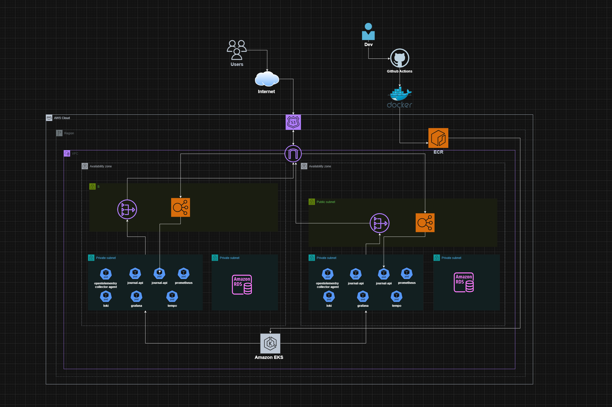

# Journal API — Cloud-Native DevOps Project

## Project Overview

Journal API is an end-to-end DevOps and cloud engineering project that demonstrates the deployment, automation, operation, and observability of a containerized FastAPI application on AWS.

The project began as a traditional two-tier deployment using Amazon EC2 and PostgreSQL and was later evolved into a containerized, Kubernetes-based architecture using Docker, Amazon ECR, Amazon EKS, Amazon RDS, GitHub Actions, and a complete observability stack.

The project demonstrates practical experience with:

* AWS cloud infrastructure
* Docker containerization
* Kubernetes and Amazon EKS
* CI/CD automation with GitHub Actions
* Infrastructure as Code with Terraform
* PostgreSQL and Amazon RDS
* AWS networking and security
* Prometheus metrics and alerting
* Grafana dashboards
* Centralized logging with Loki
* Distributed tracing with Tempo
* OpenTelemetry

---

# Architecture

The production architecture runs the Journal API as a containerized workload on Amazon EKS.

<br>

<p align="center">
  
</p>

<br>

The EKS environment spans multiple Availability Zones and uses private subnets for application workloads and database resources.

---

# DevOps Workflow

The application follows an automated CI/CD workflow using GitHub Actions.

When application changes are pushed through the development workflow, GitHub Actions performs the following stages:

1. Runs automated tests and code-quality checks.
2. Builds the Journal API Docker image.
3. Authenticates to AWS using GitHub Actions OIDC.
4. Pushes the container image to Amazon ECR.
5. Connects to the Amazon EKS cluster.
6. Updates the Kubernetes deployment.
7. Kubernetes performs a rolling deployment of the new application version.

This creates an automated path from source code to the Kubernetes environment.

```text
Code Change
     |
     v
   GitHub
     |
     v
GitHub Actions
     |
     +--> Test
     |
     +--> Docker Build
     |
     +--> Amazon ECR
     |
     +--> Amazon EKS
              |
              v
       Kubernetes Deployment
              |
              v
        Journal API Pods
```

---

# Kubernetes Deployment

The Journal API is deployed to Amazon Elastic Kubernetes Service (EKS).

The application is packaged as a Docker image and stored in Amazon Elastic Container Registry (ECR). Kubernetes worker nodes pull the image from ECR and run the application inside Kubernetes pods.

The Kubernetes deployment includes:

* Application Deployment
* Multiple application pods
* Kubernetes Service
* AWS Load Balancer integration
* Liveness probes
* Readiness probes
* Environment configuration
* Rolling deployments

The application exposes:

```text
/health
/metrics
```

The `/health` endpoint is used by Kubernetes health probes, while `/metrics` exposes application metrics for Prometheus.

---

# CI/CD Pipeline

GitHub Actions provides the project's continuous integration and continuous deployment pipeline.

### Continuous Integration

The CI stage validates application changes using:

* pytest
* Ruff
* Pyright
* PostgreSQL test database

### Container Build

After validation, GitHub Actions:

```text
Dockerfile
    |
    v
Docker Build
    |
    v
Docker Image
    |
    v
Amazon ECR
```

### Continuous Deployment

After the image is pushed to ECR, the deployment stage authenticates with AWS, connects to Amazon EKS, and applies the Kubernetes manifests.

Kubernetes then performs the application rollout across the EKS worker nodes.

AWS authentication from GitHub Actions uses **OpenID Connect (OIDC)** rather than long-lived AWS access keys.

---

# Observability

The project includes a Kubernetes-native observability stack for monitoring application and cluster health.

## Prometheus

Prometheus collects application and Kubernetes metrics.

The Journal API exposes Prometheus-compatible metrics through:

```text
/metrics
```

Metrics include application request activity and infrastructure telemetry.

---

## Grafana

<br>

<p align="center">
  
  
</p>

<br>

Grafana provides dashboards for visualizing application and Kubernetes performance.

Dashboards monitor areas such as:

* HTTP request volume
* Application error rate
* Request latency
* Kubernetes CPU usage
* Kubernetes memory usage
* Application exceptions

Grafana alerting is also configured to detect application issues such as elevated error rates or latency.

---

## Loki

Loki provides centralized log aggregation for the Kubernetes environment.

Application logs can be queried and analyzed through Grafana, allowing application failures to be correlated with metrics and traces.

---

## Tempo

Tempo provides distributed tracing.

Application requests are instrumented using OpenTelemetry and traces can be inspected through Grafana to understand request execution across application components.

---

## OpenTelemetry

The OpenTelemetry Collector provides the telemetry pipeline between the application and observability services.

```text
Journal API
    |
    v
OpenTelemetry
    |
    +------> Prometheus
    |
    +------> Loki
    |
    +------> Tempo
                 |
                 v
               Grafana
```

Together, these tools provide visibility across the three major observability signals:

```text
Metrics  -> Prometheus
Logs     -> Loki
Traces   -> Tempo
             |
             v
           Grafana
```

---

# AWS Infrastructure

The project uses several AWS services to provide compute, networking, container hosting, database services, security, and traffic management.

| AWS Service            | Purpose                             |
| ---------------------- | ----------------------------------- |
| Amazon EKS             | Managed Kubernetes cluster          |
| Amazon ECR             | Docker container image registry     |
| Amazon RDS             | Managed PostgreSQL database         |
| Amazon EC2             | EKS worker node compute             |
| Amazon VPC             | Network isolation                   |
| Elastic Load Balancing | External application traffic        |
| Route 53               | DNS                                 |
| IAM                    | AWS permissions and workload access |
| Security Groups        | Network access control              |

The environment uses multiple Availability Zones with public and private networking to provide workload isolation and improved availability.

---

# Technology Stack

| Category               | Technology     |
| ---------------------- | -------------- |
| Backend                | FastAPI        |
| Application Server     | Uvicorn        |
| Language               | Python         |
| Database               | PostgreSQL     |
| Cloud Platform         | AWS            |
| Containers             | Docker         |
| Container Registry     | Amazon ECR     |
| Orchestration          | Kubernetes     |
| Kubernetes             | Amazon EKS     |
| Infrastructure as Code | Terraform      |
| CI/CD                  | GitHub Actions |
| Metrics                | Prometheus     |
| Visualization          | Grafana        |
| Logging                | Loki           |
| Tracing                | Tempo          |
| Telemetry              | OpenTelemetry  |
| Version Control        | Git & GitHub   |

---

# Infrastructure as Code

Terraform is used to define and provision AWS infrastructure.

Infrastructure as Code allows cloud resources to be managed through version-controlled configuration rather than manual console changes.

The Terraform configuration includes infrastructure such as:

* VPC networking
* Public and private subnets
* Route tables
* Internet connectivity
* Security groups
* Amazon EKS
* EKS managed node groups
* IAM roles and permissions
* Amazon RDS

This makes the infrastructure repeatable, reviewable, and easier to reproduce.

---

# Application Features

The Journal API provides REST API functionality for creating and managing journal entries.

Application functionality includes:

* Create journal entries
* Retrieve journal entries
* Retrieve individual entries
* Update journal entries
* Delete journal entries
* Input validation
* AI-assisted journal analysis
* Application logging
* Health monitoring
* Prometheus metrics
* OpenTelemetry instrumentation

---

# Repository Structure

```text
journal-starter/
|
├── .github/
│   └── workflows/          # GitHub Actions CI/CD
│
├── api/                    # FastAPI application
│
├── k8s/                    # Kubernetes manifests
│
├── terraform/              # Infrastructure as Code
│
├── tests/                  # Automated application tests
│
├── scripts/                # Deployment/support scripts
│
├── Dockerfile              # Application container image
│
├── database_setup.sql      # PostgreSQL initialization
│
├── pyproject.toml          # Python project configuration
│
└── README.md
```

---

# Original EC2 Deployment

Before migrating the application to Kubernetes, the Journal API was deployed using a traditional AWS two-tier architecture.

The original environment consisted of:

```text
Internet
   |
   v
Public EC2
FastAPI + Uvicorn + Nginx
   |
   v
Private EC2
PostgreSQL
```

This initial deployment established the networking and infrastructure foundation before the application was containerized and migrated to Amazon EKS.

---

# Project Evolution

The project demonstrates the progression of an application from a traditional server deployment toward a modern DevOps and cloud-native architecture.

```text
FastAPI Application
        |
        v
EC2 Two-Tier Deployment
        |
        v
Docker Containerization
        |
        v
Amazon ECR
        |
        v
Kubernetes / Amazon EKS
        |
        v

GitHub Actions CI/CD
        |
        v
Terraform Infrastructure as Code
        |
        v
Full Observability
Prometheus + Grafana + Loki + Tempo + OpenTelemetry
```

Each phase introduced additional automation, scalability, reliability, and operational visibility.

---

# Key DevOps Concepts Demonstrated

This project demonstrates hands-on implementation of:

**Cloud Infrastructure**

* AWS networking and VPC design
* Public/private subnet architecture
* Security groups
* IAM
* Managed AWS services

**Containers & Kubernetes**

* Docker image creation
* Container registries
* Kubernetes Deployments and Services
* Pod scheduling
* Health checks
* Rolling deployments
* Amazon EKS

**CI/CD**

* Automated testing
* Docker image builds
* Amazon ECR publishing
* Automated Kubernetes deployments
* GitHub Actions
* AWS OIDC authentication

**Infrastructure as Code**

* Terraform
* Repeatable AWS infrastructure
* Version-controlled infrastructure configuration

**Observability**

* Application metrics
* Kubernetes metrics
* Centralized logging
* Distributed tracing
* Dashboards
* Alerting
* OpenTelemetry

---

# Project Goal

The goal of this project is to demonstrate the complete lifecycle of operating a backend application using modern cloud and DevOps practices, from infrastructure provisioning and containerization to automated deployment, Kubernetes orchestration, monitoring, logging, and distributed tracing.

The project provides hands-on experience with the technologies and operational practices commonly used in Cloud Engineering, DevOps Engineering, Platform Engineering, and Site Reliability Engineering environments.
