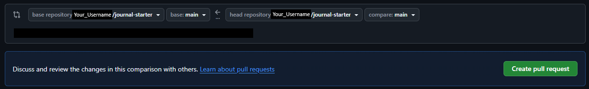

# Topic 5: Capstone - Journal API

[](https://github.com/learntocloud/journal-starter/actions/workflows/ci.yml)

Welcome to your Python capstone project! You'll be working with a **FastAPI + PostgreSQL** application that helps people track their daily learning journey. This will prepare you for deploying to the cloud in the next phase.

By the end of this capstone, your API should be working locally and ready for cloud deployment.

## ⚠️ Important: This Is a Template Repository

**Do NOT open Pull Requests against this repository (`learntocloud/journal-starter`).**

This repo is a starter template. Your work should happen on **your own fork**:

1. **Fork** this repo to your GitHub account (click the "Fork" button at the top right).
2. **Clone your fork** — not this repo.
3. Do all your work and open PRs on **your fork** (`github.com/YOUR_USERNAME/journal-starter`).

PRs opened against `learntocloud/journal-starter` will be closed without review.

---

## Table of Contents

- [Getting Started](#-getting-started)
- [Development Workflow](#-development-workflow)
- [Continuous Integration](#-continuous-integration)
- [Development Tasks](#-development-tasks)
- [Data Schema](#-data-schema)
- [AI Analysis Guide](#-ai-analysis-guide)
- [Troubleshooting](#-troubleshooting)
- [What To Do If the Upstream Repo Has Changed](#-what-to-do-if-the-upstream-repo-has-changed)
- [Extras](#-extras)
- [License](#-license)

## 🚀 Getting Started

### Prerequisites

- Git installed on your machine
- Docker Desktop installed and running
- VS Code with the Dev Containers extension

### 1. Fork and Clone the Repository

Run these commands on your **host machine** (your local terminal, not inside a container):

1. **Fork this repository** to your GitHub account by clicking the "Fork" button at the top right of this page. This creates your own copy of the project under your GitHub account.

   > ⚠️ **Important:** Always clone **your fork**, not this original repository. All your work and Pull Requests should happen on your fork. Do **not** open PRs against the original `learntocloud/journal-starter` repo.

1. **Clone your fork** to your local machine (replace `YOUR_USERNAME` with your actual GitHub username):

   ```bash
   git clone https://github.com/YOUR_USERNAME/journal-starter.git
   ```

   **Verify your remote** points to your fork (not `learntocloud`):
   ```bash
   git remote -v
   # Should show: origin  https://github.com/YOUR_USERNAME/journal-starter.git
   ```

1. **Navigate into the project folder**:

   ```bash
   cd journal-starter
   ```

1. **Open in VS Code**:

   ```bash
   code .
   ```

> 💡 **Enable GitHub Actions on your fork:** Forks have GitHub Actions workflows disabled by default. Go to the **Actions** tab on your fork and click **"I understand my workflows, go ahead and enable them"** to activate CI.

### 2. Configure Your Environment (.env)

Environment variables live in a `.env` file (which is **git-ignored** so you don't accidentally commit secrets). This repo ships with a template named `.env-sample`.

Copy the sample file to create your real `.env`. Run this from the **project root on your host machine**:

```bash
cp .env-sample .env
```

The sample already contains `DATABASE_URL` (pointing at the devcontainer's
Postgres service), `TEST_DATABASE_URL` (pointing at a separate test database),
and placeholders for the three `OPENAI_*` settings. Leave
the placeholders in place for Tasks 1–3; you'll replace them with values from
your chosen LLM provider when you reach
[Task 4](#task-4--ai-powered-entry-analysis).

> **Why are the placeholders needed?** The app uses
> [`pydantic-settings`](https://docs.pydantic.dev/latest/concepts/pydantic_settings/)
> to validate configuration when settings are first loaded. If a required setting
> is missing, `Settings()` raises a `ValidationError`. Tests never
> contact the placeholder endpoint because Task 4 uses an injected mock client.

### 3. Set Up Your Development Environment

1. **Install the Dev Containers extension** in VS Code (if not already installed)
2. **Reopen in container**: When VS Code detects the `.devcontainer` folder, click "Reopen in Container"
   - Or use Command Palette (`Cmd/Ctrl + Shift + P`): `Dev Containers: Reopen in Container`
3. **Wait for setup**: The development container provides Python and uv.
   A separate PostgreSQL container is also created. Install the application's
   Python dependencies and development tools with `uv sync` in step 5.

#### Where things run

| Location | What it provides |
|----------|------------------|
| Your host machine | VS Code, Git, and Docker Desktop; run Docker commands here |
| Development container | Python, uv, the API, tests, and your chosen cloud CLI; use the VS Code terminal here |
| PostgreSQL container | The `career_journal` application database and separate `career_journal_test` database |
| Named Docker volume (`postgres_data`) | Database files that survive container restarts and rebuilds |

The repository, including `.env`, is mounted at `/workspaces` in the development
container. The application and test settings read that file directly when run
from the project root. PostgreSQL receives its initialization settings through
Docker Compose's `env_file`; the development container deliberately does not.
Explicitly exported environment variables still override `.env`, as they do in
cloud deployments.

#### Restarting versus rebuilding

| What changed? | What to do |
|---------------|------------|
| Python application code | The API's `--reload` mode normally reloads it automatically |
| Application settings in `.env`, such as `OPENAI_*` | Stop the API with `Ctrl+C` and start it again; `.env` is not watched by default, and settings are cached |
| Devcontainer image, features, or Compose configuration | Run **Dev Containers: Rebuild Container** from the VS Code Command Palette |

**Upgrading an existing devcontainer:** Rebuild it once after pulling this
configuration change. Restarting the API or the old container alone does not
remove previously injected environment variables. After rebuilding, application
settings changes only need an API restart; scripts and test commands load the
file when started again.

Rebuilding does not delete the PostgreSQL volume or re-run database initialization
scripts against an existing volume. Changing `POSTGRES_USER`, `POSTGRES_PASSWORD`,
or `POSTGRES_DB` in `.env` also does not change an already initialized database.
Keep the sample database settings unless you intentionally update the database
itself. Do not delete the volume to troubleshoot configuration: it contains your
journal entries.

### 4. Verify the PostgreSQL Database Is Running

In a terminal on your **host machine** (not inside VS Code), run:

```bash
docker ps
```

You should see the postgres service running.

### 5. Run the API

In the **VS Code terminal** (inside the dev container), verify you're in the **project root**:

```bash
pwd
# Should output: /workspaces
```

Install the project dependencies, including the default `dev` group of testing
and code-quality tools:

```bash
uv sync
```

Then start the API from the **project root**:

```bash
uv run uvicorn api.main:app --reload --host 0.0.0.0 --port 8000
```

| Part of the command | Meaning |
|---------------------|---------|
| `uv run uvicorn` | Run the Uvicorn web server in the project's Python environment; uv also keeps required dependencies synchronized |
| `api.main:app` | Import the `app` object from `api/main.py` |
| `--reload` | Restart the server automatically when Python code changes; use this for development, not production |
| `--host 0.0.0.0` | Listen on all container network interfaces so the API can be reached through the forwarded port |
| `--port 8000` | Listen on port 8000, which the devcontainer forwards to your host |

Leave this terminal running while using the API. Use another VS Code terminal
for tests and other commands. Stop the server with `Ctrl+C`; run the same
`uv run uvicorn ...` command again to restart it.

### 6. Test Everything Works! 🎉

1. **Visit the API docs**: http://localhost:8000/docs
1. **Create your first entry** In the Docs UI Use the POST `/entries` endpoint to create a new journal entry.
1. **View your entries** using the GET `/entries` endpoint to see what you've created!

**🎯 Once you can create and see entries, you're ready to start the development tasks!**

## 🔄 Development Workflow

This project comes with several features **already built** for you — creating entries, listing entries, updating, and deleting all entries. The remaining features are left for you to implement.

The pre-built update path sends only changed text fields to PostgreSQL. A single
`UPDATE` merges those fields into the current JSONB document and returns the
stored entry, so concurrent updates to different fields do not overwrite each
other. If two requests change the same field, the last database update wins.
Entry IDs and timestamps remain application-managed.

We have provided tests so you can verify your implementations are correct without manual testing. **When you first run the tests, some will pass (for the pre-built features) and some will fail (for the features you need to build).** Your goal is to make all tests pass.

> 📍 **Where to run commands:** All commands in this section should be run from the **project root** in the **VS Code terminal** (inside the dev container). Do **not** `cd` into subdirectories like `api/` or `tests/` — run everything from the top-level project folder.

### First-Time Setup

**Tests reset the test database; your journal entries are preserved.**
The running API uses `DATABASE_URL` (`career_journal`), while database-backed
tests use only `TEST_DATABASE_URL` (`career_journal_test`). Test requests are
configured to use that separate database too. Never store personal entries in
the test database: its entries are deleted before and after every database-backed
test.

A fresh devcontainer provisions both databases automatically. Tests refuse to
run database operations if `TEST_DATABASE_URL` is missing or invalid, does not
name a database ending in `_test`, or names the same database as `DATABASE_URL`.
Database names must be in the URL path, not a `database` or `dbname` query
parameter. There is no fallback to the application database.

**Already have a devcontainer from before this change?**
Add `TEST_DATABASE_URL` from `.env-sample` to your `.env`, then run
**Dev Containers: Rebuild Container** to load the updated configuration.
Existing PostgreSQL volumes are preserved, so initialization scripts do not
automatically run again. On your **host machine**, find the PostgreSQL container
name with `docker ps`, then run:

```bash
docker exec YOUR_POSTGRES_CONTAINER psql -U postgres -d career_journal \
  -v ON_ERROR_STOP=1 -f /docker-entrypoint-initdb.d/database_setup_test.sql
```

Replace `YOUR_POSTGRES_CONTAINER` with its actual name; adjust the username and
application database if you changed the sample defaults. This command creates
the test database and applies the same schema without deleting your application
data. Do not delete the existing database volume.

From the **project root** in the VS Code terminal, synchronize dependencies
if you have not already done so in [Run the API](#5-run-the-api):

```bash
uv sync
```

The `dev` dependency group in `pyproject.toml` is included by default by both
`uv sync` and `uv run`, so pytest, Ruff, Pyright, and pre-commit remain available
after synchronizing dependencies or restarting the API.

Install the pre-commit hooks so ruff runs automatically on every commit:

```bash
uv run pre-commit install
```

Then run the tests to see the starting state:

```bash
uv run pytest
```

You should see failures for the tasks you still have to complete. Examples
include the following (the list is not exhaustive; some tests run once per
field or input value):

```
FAILED tests/test_logging.py::test_root_logger_is_configured_at_info
FAILED tests/test_logging.py::test_api_main_installs_stream_handler_with_formatter
FAILED tests/test_logging.py::test_api_main_emits_startup_log
FAILED tests/test_api.py::TestGetSingleEntry::test_get_entry_by_id_success
FAILED tests/test_api.py::TestGetSingleEntry::test_get_entry_not_found
FAILED tests/test_api.py::TestDeleteEntry::test_delete_entry_success
FAILED tests/test_api.py::TestDeleteEntry::test_delete_entry_not_found
FAILED tests/test_models.py::TestEntryCreateValidation::test_empty_string_rejected
FAILED tests/test_models.py::TestEntryCreateValidation::test_whitespace_only_rejected
FAILED tests/test_models.py::TestEntryCreateValidation::test_whitespace_stripped_from_valid_input
FAILED tests/test_models.py::TestEntryUpdateModel::test_all_fields_optional
FAILED tests/test_models.py::TestEntryUpdateModel::test_partial_update
FAILED tests/test_models.py::TestEntryUpdateModel::test_oversize_field_rejected
FAILED tests/test_api.py::TestUpdateEntry::test_update_rejects_oversize_field
FAILED tests/test_api.py::TestUpdateEntry::test_update_rejects_empty_string
FAILED tests/test_llm_service.py::test_analyze_entry_actually_calls_llm
FAILED tests/test_llm_service.py::test_analyze_entry_sends_entry_text_in_prompt
FAILED tests/test_llm_service.py::test_analyze_entry_returns_valid_analysis_response
```

The passing tests cover features that are **already built** for you
(creating entries, listing entries, updating, deleting all entries), including
the test-database configuration safeguards.
The expected failing tests correspond to Tasks 1–4 below — your job is to
turn all of them green.

### For Each Task

1. **Create a branch**

   [Branches](https://docs.github.com/en/pull-requests/collaborating-with-pull-requests/proposing-changes-to-your-work-with-pull-requests/about-branches) let you work on features in isolation without affecting the main codebase. From the **project root**, create one for each task:
   ```bash
   git checkout -b feature/your-feature-name
   ```

2. **Implement the feature**

   Write your code in the `api/` directory. Check the TODO comments in the files for guidance on what to implement.

3. **Run the tests**

   After implementing a feature, run the tests from the **project root** to check if your implementation is correct:
   ```bash
   uv run pytest
   ```
   [pytest](https://docs.pytest.org/) is a testing framework that runs automated tests to verify your code works as expected.

   - **Tests failing?** Read the error messages — they tell you exactly what's wrong (e.g., `assert 501 == 200` means your endpoint is still returning "Not Implemented").
   - **Tests passing?** Great, your implementation is correct! Move on to the next step.

   **Example: Before implementing GET /entries/{entry_id}:**
   ```
   FAILED tests/test_api.py::TestGetSingleEntry::test_get_entry_by_id_success - assert 501 == 200
   FAILED tests/test_api.py::TestGetSingleEntry::test_get_entry_not_found - assert 501 == 404
   ```

   **After implementing it correctly:**
   ```
   tests/test_api.py::TestGetSingleEntry::test_get_entry_by_id_success PASSED
   tests/test_api.py::TestGetSingleEntry::test_get_entry_not_found PASSED
   ```

   > 💡 **Tip:** Use `uv run pytest -v` for verbose output to see each test's pass/fail status, or `uv run pytest -v --tb=short` to also see concise error details.

   **Run the linter** from the **project root** to check code style and catch common mistakes:
   ```bash
   uv run ruff check .
   ```
   A linter is a tool that analyzes your code for potential errors, bugs, and style issues without running it. [Ruff](https://docs.astral.sh/ruff/) is a fast Python linter that checks for things like unused imports, incorrect syntax, and code that doesn't follow [Python style conventions (PEP 8)](https://pep8.org/).

   **Run the formatter** to auto-format your code (CI also checks formatting):
   ```bash
   uv run ruff format .
   ```

   > 💡 **Tip:** If you ran `uv run pre-commit install` earlier, both `ruff check` and `ruff format` run automatically on every commit.

   **Run the type checker** from the **project root** to ensure proper type annotations:
   ```bash
   uv run pyright
   ```
   A type checker verifies that your code uses [type hints](https://docs.python.org/3/library/typing.html) correctly. Type hints (like `def get_entry(entry_id: str) -> dict:`) help catch bugs early by ensuring you're passing the right types of data to functions. [Pyright](https://github.com/microsoft/pyright) is Microsoft's fast Python type checker.

4. **Commit and push** (only after tests pass!)

   Once the tests for your feature are passing, [commit](https://docs.github.com/en/get-started/using-git/about-commits) your changes and push to GitHub. Run from the **project root**:

   ```bash
   git add .
   ```

   ```bash
   git commit -m "Implement feature X"
   ```

   ```bash
   git push -u origin feature/your-feature-name
   ```

5. **Create a Pull Request (on your fork)**

   Go to **your fork** on GitHub (`github.com/YOUR_USERNAME/journal-starter`) and open a [Pull Request (PR)](https://docs.github.com/en/pull-requests/collaborating-with-pull-requests/proposing-changes-to-your-work-with-pull-requests/about-pull-requests) to merge your feature branch into **your own** `main` branch.

   > ⚠️ **Do NOT open PRs against the original `learntocloud/journal-starter` repository.** Your PR should merge into your fork's `main` branch. When creating the PR, make sure the "base repository" is `YOUR_USERNAME/journal-starter`, not `learntocloud/journal-starter`.

   Example:

   

> ⚠️ Do not modify the test files. Make the tests pass by implementing features in the `api/` directory. If a test is failing, it means there's something left to implement — read the error message for clues!

## 🤖 Continuous Integration

Every push and pull request runs the GitHub Actions workflow in
`.github/workflows/ci.yml`, which has two jobs:

| Job  | What it checks | How to reproduce locally |
|------|----------------|--------------------------|
| `lint` | `ruff check`, `ruff format --check`, `pyright` | `uv run ruff check . && uv run ruff format --check . && uv run pyright` |
| `test` | `pytest -v` against a dedicated test database in a real Postgres 16 service container, provisioned by `database_setup_test.sql` using the shared schema | `uv run pytest -v` |

Both jobs run on every push to `main` and every PR. Your fork will
show two green checks on a PR once **all** your implementations are complete
(i.e., Tasks 1–4 are finished). Intermediate PRs that cover only some
tasks will still have failing tests in CI — that's expected.
CI intentionally receives no learner or provider credentials. The `test`
job uses a disposable Postgres service container, and Task 4 is exercised
with an injected mock OpenAI client so CI never calls a real LLM. Task 4's
required live verification is run locally instead.

## 🎯 Development Tasks

Complete every acceptance check listed for a task. Automated tests must pass,
and the manual verification commands listed for Tasks 4 and 5 must succeed.

### Task 1 — Logging Setup

- Branch: `feature/logging-setup`
- Edit: `api/main.py`
- Acceptance: `uv run pytest tests/test_logging.py` passes

Configure `logging.basicConfig()` in `api/main.py` so the root logger
ends up at INFO with at least one handler attached. The `journal`
logger used throughout the service layer must continue to propagate.

### Task 2a — GET Single Entry Endpoint

- Branch: `feature/get-single-entry`
- Edit: `api/routers/journal_router.py`
- Acceptance: `uv run pytest tests/test_api.py::TestGetSingleEntry` passes

Implement **GET /entries/{entry_id}** to fetch an entry via
`entry_service.get_entry(entry_id)` and return 404 when not found.

### Task 2b — DELETE Single Entry Endpoint

- Branch: `feature/delete-entry`
- Edit: `api/routers/journal_router.py`
- Acceptance: `uv run pytest tests/test_api.py::TestDeleteEntry` passes

Implement **DELETE /entries/{entry_id}**, returning 404 when the entry
does not exist.

### Task 3 — Input Validation

- Branch: `feature/input-validation`
- Edit: `api/models/entry.py`, `api/routers/journal_router.py`
- Acceptance:
  - `uv run pytest tests/test_models.py::TestEntryCreateValidation` passes
  - `uv run pytest tests/test_models.py::TestEntryUpdateModel` passes
  - `uv run pytest tests/test_api.py::TestUpdateEntry` passes

Add validation to `EntryCreate` so empty, whitespace-only, and
oversize (>256 char) fields are rejected and surrounding whitespace is
stripped. Hint: `Annotated[str, StringConstraints(...)]` from Pydantic.

Then create an `EntryUpdate` model in the same file and wire it into the
PATCH endpoint in `api/routers/journal_router.py`. "Optional" here means a field
may be **omitted**, not that a supplied value may be JSON `null`.

| PATCH input | Required behavior |
|-------------|-------------------|
| A field is omitted | Keep its stored value unchanged |
| A field contains a string | Strip surrounding whitespace, then require 1-256 characters |
| A field is `null`, empty, whitespace-only, or not a string | Return 422; do not modify the stored entry |
| The body is `{}` | Accept it and leave the three text fields unchanged |

Omitted fields should default to `None` inside the model. A field validator can
reject an explicitly supplied `None` without rejecting an omitted field.
Before calling the service, convert the model to a dictionary using
`model_dump(exclude_unset=True)`. The service expects a dictionary, not a Pydantic
model; dumping all fields would overwrite omitted values with defaults.
See FastAPI's [partial-update guide](https://fastapi.tiangolo.com/tutorial/body-updates/#using-pydantics-exclude_unset-parameter).

### Task 4 — AI-Powered Entry Analysis

- Branch: `feature/ai-analysis`
- Edit: `api/services/llm_service.py`
- Acceptance:
  - `uv run pytest tests/test_llm_service.py` passes
  - `uv run python -m scripts.verify_llm` succeeds against a live LLM provider

The **POST /entries/{entry_id}/analyze** endpoint in
`api/routers/journal_router.py` is already wired up — it fetches the
entry, combines the fields into prompt text, calls
`analyze_journal_entry()`, and validates the result against `AnalysisResponse`.
Your job is to implement the LLM call itself in
`api/services/llm_service.py`.

See [AI Analysis Guide](#-ai-analysis-guide) below for the expected
response format and LLM provider setup.

### Task 5 — Cloud CLI Setup (manual)

- Branch: `feature/cloud-cli-setup`
- Edit: `.devcontainer/devcontainer.json`
- Acceptance: `az --version` / `aws --version` / `gcloud --version`
  runs successfully in the rebuilt devcontainer

Uncomment exactly one of the cloud CLI features in
`.devcontainer/devcontainer.json`, rebuild the devcontainer, and
verify the CLI is installed.

### What the automated tests cover

| Task | Automated? | How the tests verify it |
|------|------------|-------------------------|
| 1 — Logging | ✅ | `tests/test_logging.py` inspects the root logger state after importing `api.main` |
| 2a — GET single | ✅ | `tests/test_api.py::TestGetSingleEntry` via the FastAPI test client |
| 2b — DELETE single | ✅ | `tests/test_api.py::TestDeleteEntry` via the FastAPI test client |
| 3 — Input validation | ✅ | `tests/test_models.py` unit tests + `tests/test_api.py::TestUpdateEntry` PATCH validation tests |
| 4 — AI analysis | ✅ | CI injects `MockAsyncOpenAI`; required live verification runs locally with `uv run python -m scripts.verify_llm` |
| 5 — Cloud CLI | ❌ | Manual verification: run `az --version` / `aws --version` / `gcloud --version` in the rebuilt devcontainer |

## 📊 Data Schema

Each journal entry follows this structure:

| Field       | Type      | Description                                | Validation                   |
|-------------|-----------|--------------------------------------------|------------------------------|
| id          | string    | Unique identifier (UUID)                   | Auto-generated               |
| work        | string    | What did you work on today?                | Required, max 256 characters |
| struggle    | string    | What's one thing you struggled with today? | Required, max 256 characters |
| intention   | string    | What will you study/work on tomorrow?      | Required, max 256 characters |
| created_at  | datetime  | When entry was created                     | Auto-generated UTC           |
| updated_at  | datetime  | When entry was last updated                | Auto-updated UTC             |

## 🤖 AI Analysis Guide

For **Task 4: AI-Powered Entry Analysis**, your endpoint should return this format:

```json
{
  "entry_id": "123e4567-e89b-12d3-a456-426614174000",
  "sentiment": "positive",
  "summary": "The learner made progress with FastAPI and database integration. They're excited to continue learning about cloud deployment.",
  "topics": ["FastAPI", "PostgreSQL", "API development", "cloud deployment"],
  "created_at": "2025-12-25T10:30:00Z"
}
```

The pre-built `AnalysisResponse` model enforces this contract for both the API
and the live verification helper:

| Field | Required content |
|-------|------------------|
| `sentiment` | Exactly `positive`, `negative`, or `neutral` |
| `summary` | A nonempty string after stripping surrounding whitespace |
| `topics` | 2-4 strings, each nonempty after stripping surrounding whitespace |

Aim for **two sentences** in the summary. This is writing guidance, not a strict
sentence-counting rule; abbreviations and punctuation should not make otherwise
valid summaries fail validation.

Invalid analysis content must not be reported as success. The API returns 502
when analysis fails model validation, and the live helper exits unsuccessfully
when a returned result violates the model.

### Requesting structured output

`response.output_text` is the model's text, **not a guarantee of valid JSON**.
An unconstrained response can contain prose or Markdown fences, which
`json.loads()` cannot parse as a JSON object.

Include the full journal text in your input and explicitly request the three
generated fields: `sentiment`, `summary`, and `topics`. Prefer a provider/model
that supports [Structured Outputs](https://platform.openai.com/docs/guides/structured-outputs).
With the Responses API, the format configuration belongs in the `text` argument
to `client.responses.create()`:

```python
text={
    "format": {
        "type": "json_schema",
        "name": "journal_analysis",
        "strict": True,
        "schema": analysis_schema,
    }
}
```

Define `analysis_schema` as a JSON Schema object for those three fields. Mark all
three as required and set `additionalProperties` to `False`. Use the allowed
sentiments, a string summary, and an array of string topics. Providers and models
support different subsets of JSON Schema, so check their supported constraints
and always validate the result locally with `AnalysisResponse`.

If the selected model supports JSON mode but not strict structured outputs,
`text={"format": {"type": "json_object"}}` is an alternative. Your prompt must
still explicitly request JSON, and JSON mode does **not** guarantee the required
fields, sentiment values, or topic counts. Do not use the Chat Completions
`response_format` parameter with the Responses API.

Before returning an analysis:

1. Check that the response completed successfully. Handle incomplete output,
   refusals, and empty `output_text` as failures, even when structured output
   was requested.
2. Parse the JSON and reject malformed output; do not substitute a default
   sentiment, empty summary, or fake successful result.
3. Use the function's `entry_id` argument for the result, not an ID generated by
   the LLM. Validate with `AnalysisResponse`, which also supplies `created_at`,
   and return the validated model's dictionary representation.

Let provider, parsing, and validation errors surface rather than catching them
and returning success. The existing router returns 501 for the unfinished TODO,
502 for a Pydantic validation failure, and 500 for other analysis exceptions.
The live verification command must fail when analysis fails.

The mocked tests exercise the SDK call and result shape, but cannot prove that a
provider accepts your chosen model, schema, or credentials. The live verification
below remains required. Close a client you create inside the service when you
are done; leave an injected client's lifetime to its caller.

### Task 4 setup

This project mandates the [OpenAI Python SDK](https://github.com/openai/openai-python),
using its [Responses API](https://platform.openai.com/docs/api-reference/responses).
Choose a provider and model that support the Responses API:

| Provider | `OPENAI_BASE_URL` | `OPENAI_MODEL` |
|----------|-----------------------|----------------|
| Microsoft Foundry Models | `https://<resource>.services.ai.azure.com/openai/v1/` | Your deployment name |
| OpenAI | `https://api.openai.com/v1` | A model available to your account |

Configure your provider via `.env`. CI intentionally remains mocked and does
not receive learner or provider credentials, so these values must not be
added to the GitHub Actions workflow:

```
OPENAI_API_KEY=<your provider API key>
OPENAI_BASE_URL=<your provider Responses API-compatible v1 endpoint>
OPENAI_MODEL=<your provider model ID or deployment name>
```

These variables are loaded by [`api/config.py`](api/config.py)'s `Settings`
class. All three are required because endpoints and model names differ between
providers. If you mistype a variable name, `Settings()` will raise a
`ValidationError` when settings are loaded, naming the missing field.

After replacing the placeholders, restart any running API so it reads the new
values. You do not need to rebuild the devcontainer for these edits once you
have applied the one-time configuration upgrade described under
[Restarting versus rebuilding](#restarting-versus-rebuilding).

For Microsoft Foundry, create a model deployment and copy its endpoint, key,
and deployment name from the portal. See the
[Foundry Models endpoint documentation](https://learn.microsoft.com/azure/foundry/foundry-models/concepts/endpoints).

To complete Task 4, verify the implementation against a live provider with
the bundled helper script:

```bash
uv run python -m scripts.verify_llm
```

This live check is required for local acceptance but is not part of CI. Both
Microsoft Foundry Models and OpenAI remain supported, provided the selected
model or deployment supports the OpenAI Responses API.

> **Phase 4 preview:** In Phase 4, you'll migrate this same code to a
> cloud AI platform. Providers with a Responses API-compatible endpoint only
> require environment variable changes; providers without one need an adapter.

## 🔧 Troubleshooting

**API won't start?**
- Run `uv run uvicorn api.main:app --reload --host 0.0.0.0 --port 8000`
  from the **project root** inside the devcontainer.
- Check PostgreSQL is running: `docker ps` (on your **host machine**)
- Restart the database: `docker restart your-postgres-container-name` (on your **host machine**)

**`pydantic_core._pydantic_core.ValidationError` when settings load?**
- One of the required env vars in your `.env` file is missing or mistyped.
  The error message names the field (e.g. `database_url` or `openai_api_key`).
  Add it to `.env` — the defaults in [`.env-sample`](.env-sample) are a good
  starting point — and restart.

**Can't connect to database?**
- Verify `.env` file exists with correct `DATABASE_URL`
- Check the PostgreSQL container is running and restart the API after editing
  its connection settings. Rebuilding does not reset existing database credentials.

**Edited `.env`, but the API still uses old values?**
- Stop and restart the API; automatic Python reload does not watch `.env` by default.
- If this devcontainer predates the configuration change, rebuild it once to
  remove the old container-injected settings.
- Remove any conflicting variables you explicitly exported in your terminal;
  process environment variables take precedence over `.env`.

**Database-backed tests fail during setup?**
- Check `TEST_DATABASE_URL` in `.env` points to the dedicated test database,
  not your application database.
- If `career_journal_test` does not exist, follow the existing-devcontainer
  instructions under [First-Time Setup](#first-time-setup).
- Tests marked `no_db` do not need a database connection and can be run with
  `uv run pytest -m no_db`.

**Dev container won't open?**
- Ensure Docker Desktop is running
- Try: `Dev Containers: Rebuild and Reopen in Container`

## 🔄 What To Do If the Upstream Repo Has Changed

If the original `learntocloud/journal-starter` repository has changed, merge its
updates into your fork. **Do not delete your fork to update it.** Keeping it
preserves your branches, pull requests, discussions, and repository settings.

Run these commands from the **project root** in the VS Code terminal. Stop if a
command reports an error; do not continue with later steps until it is resolved.
In the command blocks, `&&` runs the next command only if the previous one succeeds.

### Sync Your Fork with Upstream

1. **Save your work before switching branches.**

   ```bash
   git status
   git branch --show-current
   ```

   Note your current feature branch. Commit any intended changes there using the
   [development workflow](#-development-workflow), and make sure `git status`
   reports a clean working tree. Do not commit `.env` or other secrets.
   Create a backup pointer to the current commit:

   ```bash
   git branch backup/before-upstream-sync
   ```

   Choose a new backup name if that branch already exists. A backup branch
   preserves committed work, not uncommitted files, ignored files, or database
   contents. Keep your existing clone and database volume.

2. **Verify your remotes.**

   ```bash
   git remote -v
   # origin    https://github.com/YOUR_USERNAME/journal-starter.git (fetch)
   # origin    https://github.com/YOUR_USERNAME/journal-starter.git (push)
   # upstream  https://github.com/learntocloud/journal-starter.git (fetch)
   # upstream  https://github.com/learntocloud/journal-starter.git (push)
   ```

   `origin` must point to **your fork**. If `upstream` is missing, add it once:

   ```bash
   git remote add upstream https://github.com/learntocloud/journal-starter.git
   ```

   If it already exists, verify its URL rather than adding it again.

3. **Bring your local `main` up to date with your fork.**

   ```bash
   git checkout main && git pull --ff-only origin main
   ```

   If Git refuses the fast-forward because local and remote `main` have diverged,
   stop and reconcile those commits before continuing. Do not discard commits
   or force-push to get past the error.

4. **Merge upstream on a dedicated branch.**

   ```bash
   git fetch upstream &&
   git checkout -b maintenance/sync-upstream &&
   git merge upstream/main
   ```

   Choose a new branch name if `maintenance/sync-upstream` already exists, and
   use that name in the later push command. This keeps your fork's `main`
   unchanged while you review the update.

5. **Resolve conflicts if Git reports them.**

   Large upstream changes may conflict with your task implementations. Run
   `git status` to find unresolved files, then inspect conflict markers:

   ```
   <<<<<<< HEAD
   # your code
   =======
   # upstream code
   >>>>>>> upstream/main
   ```

   Combine the upstream changes with your intended behavior. Do not blindly
   accept all incoming changes: that can remove your completed task code.
   If the structure changed, adapt your implementation to it and refer to your
   backup branch as needed.

   After editing each conflict, remove the markers and stage the resolved files.
   Replace `path/to/resolved-file` below with an actual filename; repeat the
   `git add` command for each resolved file. Review the staged changes before
   completing the merge:

   ```bash
   git add path/to/resolved-file
   git diff --cached
   git commit -m "Merge upstream changes"
   ```

   If there were no conflicts, Git normally completes the merge automatically,
   so an extra commit is not needed. To abandon an unresolved merge and discard
   your in-progress conflict resolutions, use `git merge --abort`.

6. **Review the update and open a PR on your fork.**

   Run `uv sync`, then the relevant tests and code-quality commands from the
   [development workflow](#-development-workflow). Failures for unfinished
   learner tasks are still expected; investigate new failures in work you have
   already completed.

   Push the synchronization branch to **your fork**:

   ```bash
   git push -u origin maintenance/sync-upstream
   ```

   Open a PR from this branch to your fork's `main`, review it, and merge it.
   Do not target `learntocloud/journal-starter`.

7. **Refresh `main` after merging the PR, then update any feature branch still in progress.**

   ```bash
   git checkout main && git pull --ff-only origin main
   ```

   If you have a feature branch to continue:

   ```bash
   git checkout your-feature-branch &&
   git merge main
   ```

   Replace `your-feature-branch` with the branch you noted in step 1. Resolve any
   conflicts using the same process, and keep the backup branch until you are
   satisfied that your work is preserved.

This workflow uses merges so existing commit history is preserved; it does not
require deleting the fork, resetting branches, or force-pushing.

## 📚 Extras

- [Explore Your Database](docs/explore-database.md) - Connect to PostgreSQL and run queries directly

## 📄 License

MIT License - see [LICENSE](LICENSE) for details.

Contributions welcome! [Open an issue](https://github.com/learntocloud/journal-starter/issues) to get started.
