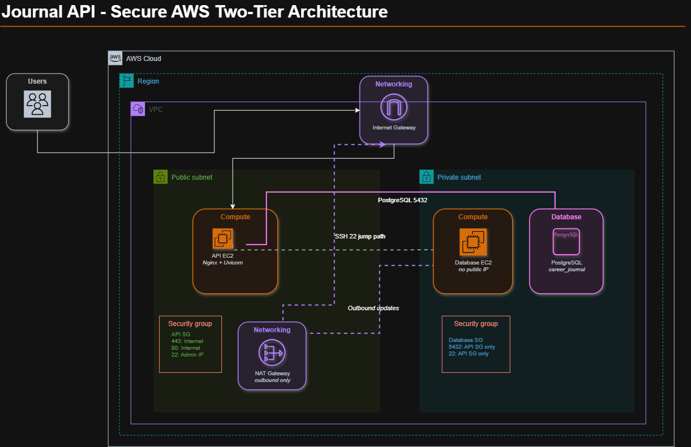

# Journal API

## Project Overview

Journal API is a backend deployment project that demonstrates how to host a FastAPI application using a secure two-tier architecture on AWS. The project separates the application and database into different network tiers to reduce the attack surface and follow common cloud infrastructure practices.

The application tier runs on a public Amazon EC2 instance and serves a FastAPI application through Uvicorn behind an Nginx reverse proxy. The data tier runs on a separate Amazon EC2 instance inside a private subnet and hosts a PostgreSQL database. AWS networking resources provide controlled communication between both tiers while preventing direct access to the database from the public internet.

The project focuses on infrastructure design, cloud networking, and automated deployment rather than application features.

---

## Architecture

<br>

<p align="center">
  
</p>

<br>

## Architecture Overview

The deployment uses a two-tier architecture.

The application tier hosts the FastAPI backend, Uvicorn application server, and Nginx reverse proxy on a public EC2 instance. This instance accepts HTTPS requests from clients and forwards them to the application.

The data tier hosts a PostgreSQL database on a separate EC2 instance inside a private subnet. The database has no public IP address and accepts connections only from the application tier.

The AWS networking layer connects both tiers through a dedicated Virtual Private Cloud (VPC), public and private subnets, route tables, an Internet Gateway, a NAT Gateway, and security groups.

---

## Technology Stack

| Category | Technology |
|----------|------------|
| Backend | FastAPI |
| Application Server | Uvicorn |
| Reverse Proxy | Nginx |
| Database | PostgreSQL |
| Cloud Platform | AWS |
| Compute | Amazon EC2 |
| Networking | Amazon VPC |
| Security | Security Groups |
| Deployment | Bash |

---

## Infrastructure Overview

The deployment provisions the following AWS resources:

- Virtual Private Cloud (VPC)
- Public Subnet
- Private Subnet
- Internet Gateway
- NAT Gateway
- Route Tables
- Security Groups
- Public EC2 Instance (Application Tier)
- Private EC2 Instance (Database Tier)

Application components include:

- FastAPI
- Uvicorn
- Nginx
- PostgreSQL

---

## Repository Structure

```text
journal-starter/
├── api/
├── database/
├── scripts/
├── deploy.sh
├── pyproject.toml
├── uv.lock
└── README.md
```

---

## Deployment

The infrastructure and application deployment are automated through the `deploy.sh` script. The script provisions the required AWS resources, configures the networking layer, installs the application dependencies, configures PostgreSQL, and deploys the application.

For the complete deployment workflow and implementation details, see `deploy.sh`.
